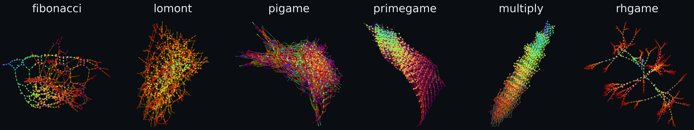
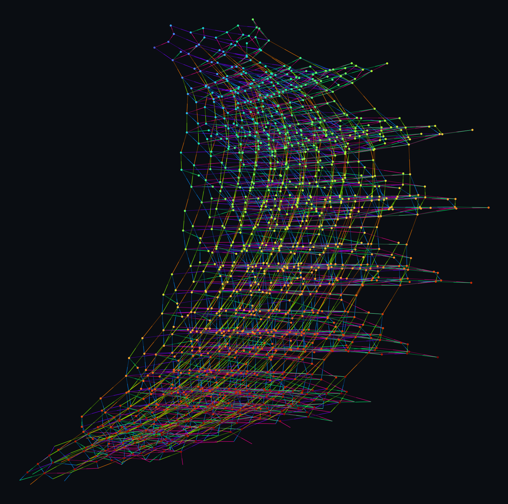
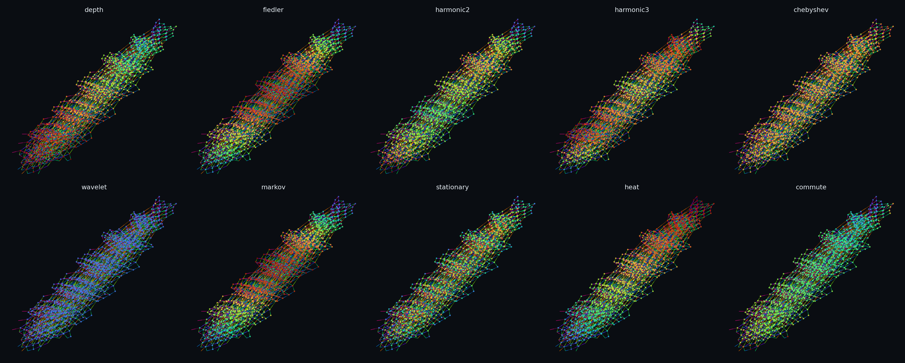
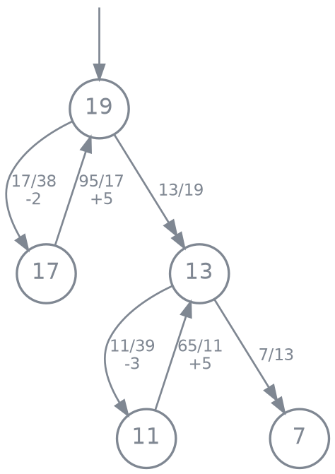

# fractran



<sub>*Multiway graphs of six FRACTRAN programs (left → right: `fibonacci`, the Lomont
self-interpreter, `PIGAME`, `PRIMEGAME`, Conway's `MULTIPLY`, `RHGAME`). Every integer
state is a vertex; every applicable fraction is an edge (faded dim→bright along its
direction); colour is BFS depth from the start.*</sub>

A complete FRACTRAN toolchain — interpreter, compiler, loop accelerator, native
C++/GMP core, a self-interpreter, and a pile of runnable I/O programs — built up
from Conway's "just multiply fractions."

## What is FRACTRAN?

John Conway's esoteric language. A program is an ordered list of fractions; the
state is a single positive integer `n`. Each step multiplies `n` by the first
fraction that keeps it an integer, halting when none does. It's Turing-complete:
the exponent of prime `p` in `n` is register `p`, and a fraction is a guarded
register update (divisibility is the guard). The whole system is a register /
Minsky machine written multiplicatively.

## Quickstart

```sh
# compiled FRACTRAN programs doing real terminal I/O
python3 demos.py rule30 20        # Rule 30 cellular automaton (the chaotic triangle)
python3 demos.py pyramid 6        # ASCII pyramid
python3 demos.py collatz 27       # Collatz trajectory of 27
python3 demos.py march 30         # animation: a '*' walks across
python3 demos.py gcd 1071 462     # Euclid's algorithm

# a calculator compiled to 188 fractions, reading stdin, writing stdout
printf '0 3 4\n1 6 7\n3 17 5\n' | python3 calc.py    # 7, 42, then 3 and 2

# watch Conway's PRIMEGAME emit primes live, with register bars
python3 visualize.py primegame

# show any program's actual fraction list
python3 demos.py rule30 --show
```

## Tests & demos

Every script is runnable as `python3 <name>`. Core toolchain:

```sh
python3 demo.py            # interpreter, streaming I/O, compiler, decompiler (self-test)
python3 bench.py           # loop accelerator: exact vs reference, big speedups
python3 bootstrap_demo.py  # a FRACTRAN self-interpreter, compiled from the toolchain
python3 io_demo.py         # compiled streaming transducers (doubler, running sum)
```

Arithmetic & representation:

```sh
python3 calc_demo.py       # the calculator vs Python arithmetic
python3 dump_calc.py       # print the calculator's 188 fractions (+ save calc_program.fractran)
python3 prove_calc.py      # re-parse the bare fraction list and run it (it's all fractions)
python3 gallery_demo.py    # PRIMEGAME (verified) + Lomont self-interpreter encoder
python3 measure_repr.py    # compact binary format + compression study
python3 represent.py       # representation-size measurements
```

Order-free structure, spectra, and the theory threads:

```sh
python3 reach_demo.py      # unfoldings, confluence, normal forms, region flow
python3 spectral_demo.py   # move dispersion, drift, Newton polytope, box spectrum
python3 modes_demo.py      # dispersion amoeba + graph-Fourier modes (Fiedler vector)
python3 continuum_demo.py  # the fluid limit: density transport at the drift rate
python3 rhgame_demo.py     # RH as a halting problem: compiled sigma(n) + Robin search
```

## Native core (optional, fast)

```sh
make -C native             # builds native/fractran_core (needs GMP)
python3 bench_native.py    # ~130x over the pure-Python stepper
```

Two modes: **vector** (int64 prime exponents — the fast path) and **canonical**
(a real GMP integer `n` — the faithful, unbounded oracle).

## Exploring the order-free structure (`reach.py`)

Deterministic FRACTRAN fires the *first* applicable fraction. Drop that priority
and the fractions become commuting lattice moves; a state then unfolds into a
whole reachability graph. `reach.py` explores it.

**Unfold from a start state** — fire *any* applicable fraction:

```sh
python3 reach.py "1/2 1/3" 36      # the grid / distributive lattice (drains to 1)
python3 reach.py "3/2 5/2" 4       # a resource conflict -> 3 normal forms {9,15,25}
```

It reports the reachable states and edges; how branches split into **concurrency**
(independent moves — diamonds that reconverge) vs **conflict** (moves competing
for a factor — true forks); the **normal forms** (halting states); and whether the
program is **confluent** (unique normal form, so evaluation order doesn't matter).
For two-prime programs it draws the reachable set as a grid.

**Evolve a whole region** — every state in a bounded box at once:

```sh
python3 reach.py "2/3 3/2" --region 2:3,3:3
```

`--region 2:3,3:3` is the box `0 <= v2 <= 3, 0 <= v3 <= 3`. It reports the
**sinks** (normal forms), **boundary** states (whose moves leave the box), and
**cyclic components** — sets of states the flow cycles through. For `{2/3, 3/2}`
these are the anti-diagonals of constant `v2 + v3`: that sum is conserved (a
Petri-net *place-invariant*), so the dynamics rotate within each level set.

Programmatic API in `fractran/reachability.py`: `reachable`, `analyze`,
`confluent`, `normal_form`, `region_graph`, `analyze_region`, `render_grid`.
See `reach_demo.py` for worked examples.

**Draw the graph** — render the reachability graph to a PNG (needs matplotlib):

```sh
python3 plot_reach.py "1/2 1/3" 72 graph.png       # connected 12-node lattice, drains to 1
python3 plot_reach.py "3/2 5/2" 4 conflict.png     # branches into normal forms {9,15,25}
```

Nodes are states (labelled by the integer), green = start, red = halting normal
form; two-prime programs are laid out on the exponent lattice `(v_p, v_q)` — the
Hasse diagram. Open the PNG in any image viewer.

## Visualization (`fractran/plot.py`)

Every FRACTRAN program is a **multiway graph**: fire every applicable fraction at
every integer state and connect directed edges. `plot_multiway` renders it with
edges coloured by which fraction fired and nodes coloured by a chosen field.

```sh
python3 -c "from fractran.plot import plot_multiway; from fractran.programs import MULTIPLY; \
           plot_multiway(MULTIPLY, 2**3*3**3, 'multiply.png', node_by='depth')"
```



The node colouring can be any of eleven **structural or spectral** fields
(`NODE_FIELDS`): `depth`, `logn`, `fiedler` and `harmonic2/3` (graph-Fourier /
Pontryagin modes), `chebyshev` (a graph filter), `wavelet`, `markov` (random-walk
mode), `stationary`, `heat` (heat kernel), `commute` (effective resistance).
`plot_spectral_gallery` paints one lattice by all of them at once:



Everything shares one `Style` object and one `draw_graph` renderer, so a look
change propagates to every image. Other renderers: `plot_network` (divisor-lattice
hypercubes), `plot_multiway_montage` (a grid across programs), `plot_collatz_coral`
(all Collatz trajectories), `plot_spacetime`, `plot_rule30`, and the labelled
`plot_reachability` behind `plot_reach.py` / `reach.py --plot`. Full reference and
the math of each field: [fractran-overview.md §11](fractran-overview.md).

### Conway flowcharts (`plot_conway`)

Conway drew FRACTRAN programs as **register-machine flowcharts** (his 1987 paper,
§7 "Beginners' Guide"): one node per program *line* / control state, each fraction
a directed edge to the line it jumps to, the number of arrowheads giving that
fraction's **priority** at the node (single = tried first, double = next), with
self-loops, a start stub, and stop stubs. `plot_conway` reproduces this (rendered
with graphviz) — it recovers the control states from the raw fraction list with the
decompiler (`fractran/decompile.py`), so it draws the *finite, collapsed* machine,
independent of the input value (needs the graphviz `dot` binary + `pydot`):

```sh
python3 -c "from fractran.plot import plot_conway; from fractran.programs import make_add; \
           c=make_add(); plot_conway(c.fractions, c.start(a=3,b=4), 'add.png')"
```



### Themes

Everything takes a `style=`; `THEMES` has `dark` (default), `light`, `paper`, and
`transparent` (a `Style` with `bg=None` renders on a transparent background). Build
your own `Style(node_size=…, edge_cmap=…, bg=…)` and pass it to any renderer —
background colour and every other setting is user-controllable from that one object.

## Documentation

- **[fractran-overview.md](fractran-overview.md)** — module-by-module tour: the
  interpreter, compiler, streaming-I/O mechanism (§3′, §9), accelerator, native
  core, self-interpreter, reachability, and the visualization suite (§11).
- **[theory.md](theory.md)** — the mathematics: prime-valuation lattice, p-adic
  and height dynamics, vector addition systems, binomial/toric ideals,
  universality, and the genus-0/1 (elliptic) boundary.
- **[explorations.md](explorations.md)** — deeper threads: the Bost–Connes bridge
  to ζ, the two Weils, continuum limits, graph Fourier = the Pontryagin transform,
  and RHGAME.

## Architecture

`fractran/` is a dependency-free Python package. The pipeline is:

> structured front-end → Minsky IR → fraction list → (accelerate / run native)

| module | role |
|---|---|
| `core.py` | exponent-vector interpreter (a step is a guarded vector add) |
| `minsky.py` / `build.py` | Minsky IR + structured front-end that lower to fractions |
| `io.py` | streaming I/O trampoline (READ/WRITE/DONE halt-and-resume) |
| `accel.py` | loop accelerator (collapse constant-effect loops to closed form) |
| `decompile.py` / `viz.py` | recover the control-flow graph; live terminal visualizer |
| `native.py` + `native/` | binding to the C++/GMP core |
| `bootstrap.py` | a FRACTRAN self-interpreter, compiled from this toolchain |
| `calc.py` / `demos.py` | the calculator and the I/O demo gallery |
| `serialize.py` | compact binary representation of programs |
| `reachability.py` | order-free (nondeterministic) evolution: unfoldings, confluence, region flow |
| `plot.py` | draw the reachability graph to a PNG (lattice layout for two-prime programs) |
| `spectral.py` | graph-Fourier / Pontryagin analysis: move dispersion, drift, Newton polytope, Laplacian modes, and the numerical spectrum of reachability boxes |
| `continuum.py` | the fluid limit: density transport on a box (drift/diffusion, mean-height flow) |
| `rhgame.py` | RH as a halting problem — Robin's inequality; a compiled FRACTRAN `sigma(n)` kernel plus the violation search |

Design notes, the module-by-module tour, the external gallery, and the roadmap
live in **[fractran-overview.md](fractran-overview.md)**. The deep theoretical
landscape — the prime-valuation lattice, p-adic and height dynamics, vector
addition systems, binomial/toric ideals, universality, and where elliptic curves
do and don't enter — is in **[theory.md](theory.md)**, with citations. Deeper and
more speculative threads — the Bost–Connes bridge to $\zeta$, the two Weils,
continuum limits, and the toric geometry of program synthesis — are collected in
**[explorations.md](explorations.md)**.
